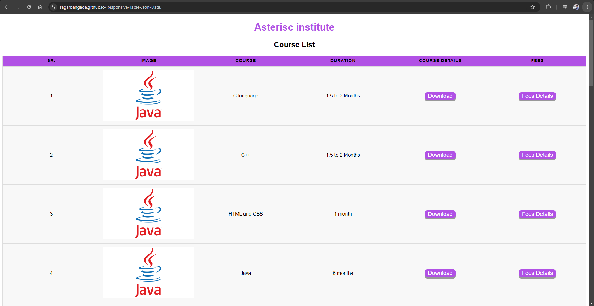
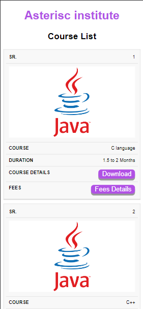

# 🌟 Responsive Table 🌟

Welcome to the **Responsive Table** repository! This project showcases a dynamic table displaying various data in a user-friendly, responsive design. The table is populated with data from a JSON file and is designed to be easily accessible on both desktop and mobile devices.

## 🚀 Live Demo
Check out the live demo of the project [https://sagarbangade.github.io/Responsive-Table-Json-Data/](#). 

## 📸 Screenshots

### 💻 Desktop View
 <!-- Replace with the actual desktop screenshot image -->

### 📱 Mobile View

